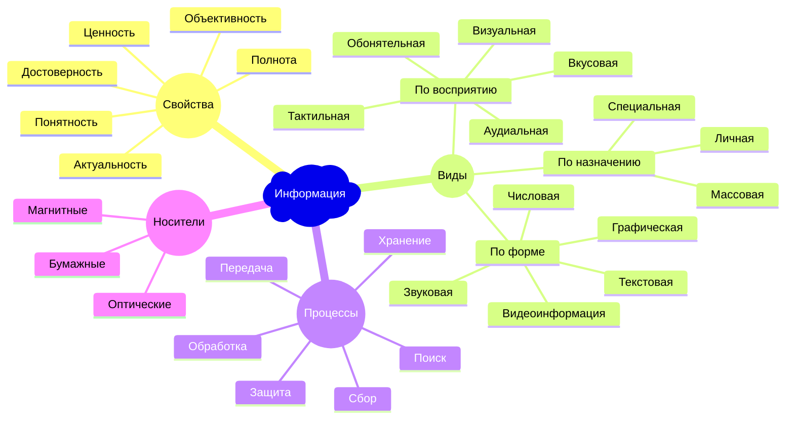
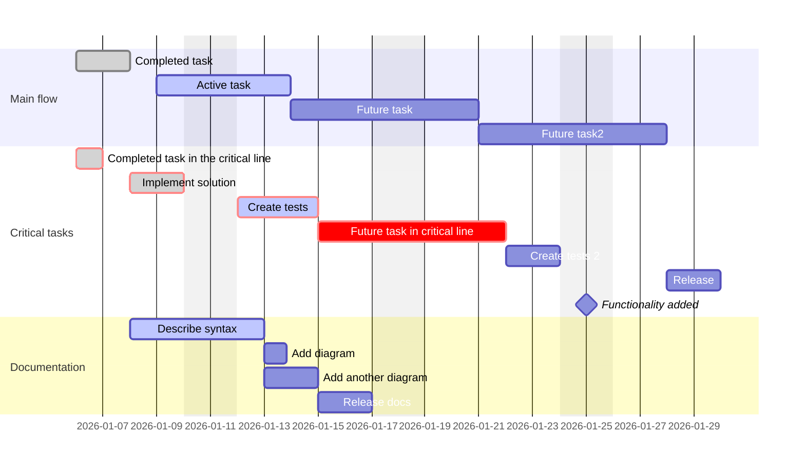
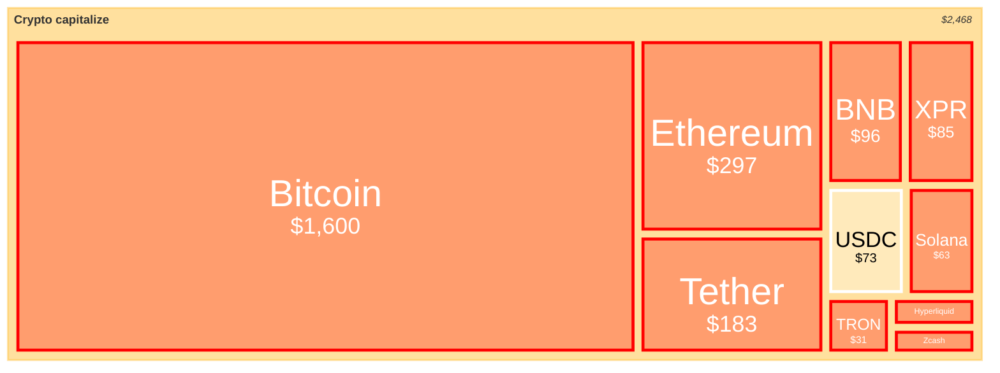
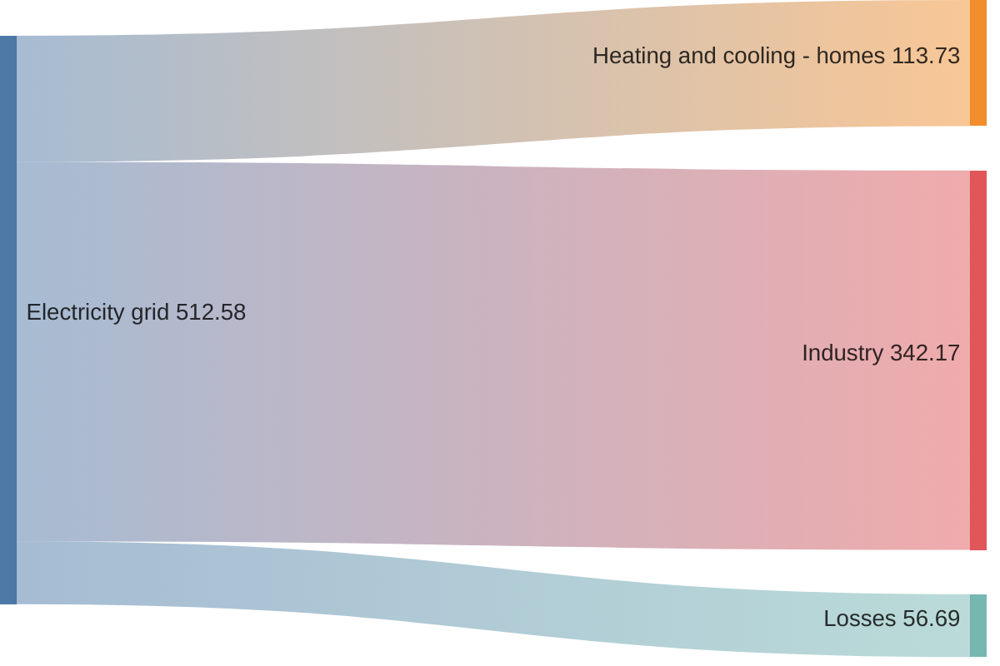

```mermaid
mindmap
root)Информация(
    ((Свойства))
        Объективность
        Достоверность
        Полнота
        Актуальность
        Ценность
        Понятность
    ((Виды))
        По восприятию
            Визуальная
            Аудиальная
            Тактильная
            Обонятельная
            Вкусовая
        По форме
            Текстовая
            Графическая
            Звуковая
            Числовая
            Видеоинформация
        По назначению
            Массовая
            Специальная
            Личная
    ((Процессы))
        Сбор
        Хранение
        Передача
        Обработка
        Поиск
        Защита
    ((Носители))
        Бумажные
        Магнитные
        Оптические
```

```mermaid
gantt
    dateFormat YYYY-MM-DD
    excludes weekends

    section Main flow
    Completed task :done, des1, 2026-01-06, 2026-01-08
    Active task :active, des2, 2026-01-09, 3d
    Future task :des3, after des2, 5d
    Future task2 :des4, after des3, 5d

    section Critical tasks
    Completed task in the critical line :crit, done, 2026-01-06, 1d
    Implement solution :crit, done, after des1, 2d
    Create tests :crit, active, 3d
    Future task in critical line :crit, 5d
    Create tests 2 :2d
    Release :des5, after des4, 2d
    Functionality added :milestone, isadded, 2026-01-25, 0d

    section Documentation
    Describe syntax :active, a1, after des1, 3d
    Add diagram :a2, after a1, 20h
    Add another diagram :doc1, after a1, 48h
    Release docs :doc_release, after doc1, 48h
```

```mermaid
---
config:
    theme: 'base'
    themeVarisables:
        fontFamily: trebuchet ms
    treemap:
        valueFormat: '$0,0'
---
treemap-beta
"Crypto capitalize"
    "Bitcoin": 1600:::fall
    "Ethereum": 297:::fall
    "Tether": 183:::fall
    "BNB": 96:::fall
    "XPR": 85:::fall
    "USDC": 73:::notchanged
    "Solana": 63:::fall
    "TRON": 31:::fall
    "Hyperliquid": 21:::fall
    "Zcash": 19:::fall

classDef fall fill:red,color:white,stroke:red;
classDef notchanged fill:white,color:black,stroke:white;
```

```mermaid
sankey

Electricity grid,Heating and cooling - homes,113.726
Electricity grid,Industry,342.165
Electricity grid,Losses,56.691
```
